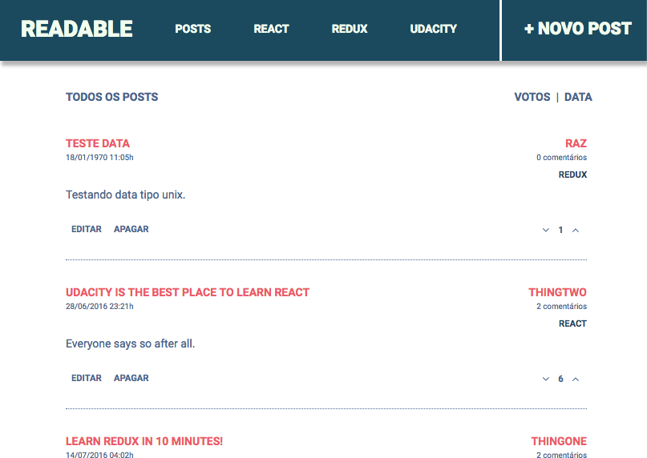
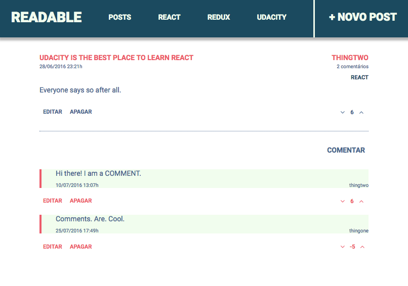
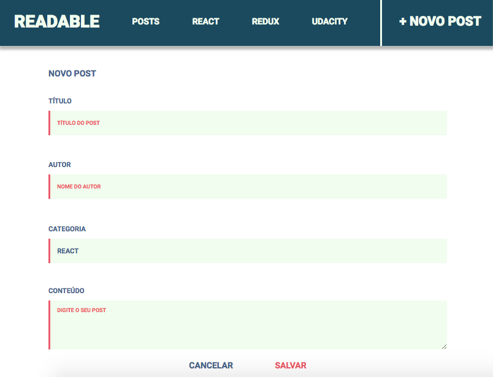
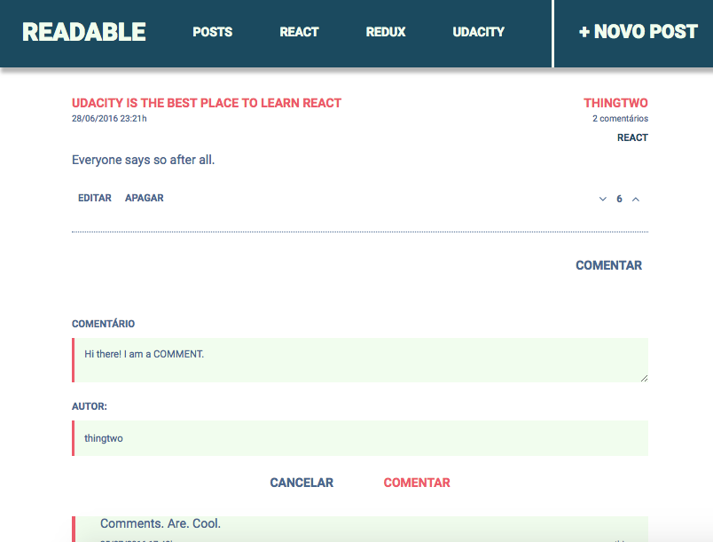
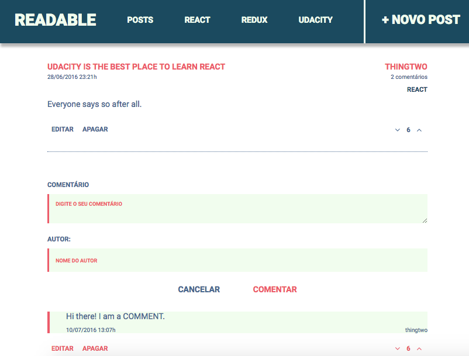

# Projeto Readable NanoDegree React - Udacity

Este projeto é o trabalho 2 do Curso Nanodegree de Desenvolvedor React da Udacity.

## Para executar o projeto

Para executar este projeto é necessário que tenha o Node e o Yarn (ou NPM) instalado em seu computador, e seguir os seguintes passos:

* Faça o donwload ou o clone deste projeto;
* Em seu terminal navegue até a pasta principal/api-server do projeto;
* Instale as dependências do servidor com o comando `yarn install && node server` (ou `npm install && node server`);
* Abra outra janela do terminal navegue até a pasta principal/frontend do projeto;
* Instale as dependências com o comando `yarn install && yarn start` (ou `npm install && npm start`);
* O seu navegador principal deverá abrir uma janela e carregar o projeto.

## Principais bibliotecas usadas neste projeto

* React
* React Router
* Prop-types
* Redux
* React-Redux
* Redux-Saga
* Moment.JS
* Lodash
* Styled-Components
* React-Icons

## Screenshots do Projeto

## Checking de Implementações realizadas

- [x] Postagens listadas com título, autor, número de comentários, data, votos, e possibilidade de votar, editar ou deletar;
- [x] Possui link no título da postagem para levar o usuário a uma página de detalhe da postagem;
- [x] Ordenação de Posts por votos e data de postagem, ao clicar pode ordenar de forma ascendente ou descendente;
- [x] Links no menu para navegar entre as postagens de cada categoria que terá as mesmas características acima;
- [x] Link no menu para adicionar novo post;
- [x] Na página de detalhe do Post são mostrados os comentários com o autor, votos, possibilidade de votar, editar ou deletar;
- [x] É possível também adicionar novos comentários nesta mesma página;
- [x] Página 404 e de mensagens de erros para o caso de acessar post apagado, links inexistentes, ou para o caso de não haver nenhum post;
- [x] Foi utilizado a biblioteca Redux-Saga para integração ao Redux para manipular as actions do projeto;
- [x] O layout do projeto foi desenvolvido por mim em Skecth;
- [x] CSS implementado usando a biblioteca Styled-Components para manter os componentes completos em lógica e layout.
